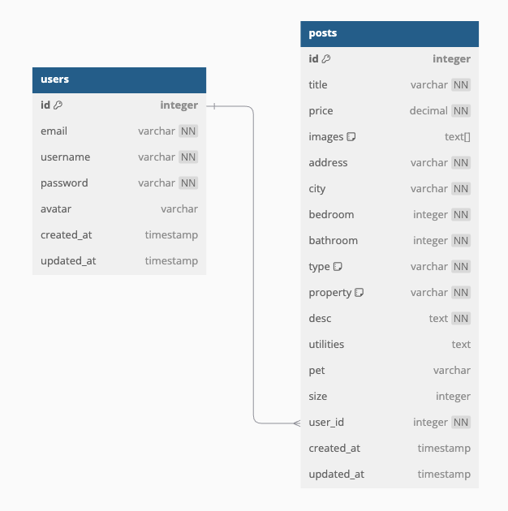

# Ramzillow - Real Estate Marketplace (Backend)

#### A Node.js backend API for managing real estate listings, authentication, and user data.

## Description

This is the **backend for Ramzillow**, built using **Node.js and Express**. It handles **user authentication, property listings, image uploads, and data storage** using **MongoDB**.

## Table of Contents

- [Technologies Used](#technologiesused)
- [Features](#features)
- [Database Schema & ERD](#erd)
- [Project Next Steps](#nextsteps)
- [Deployed API](#deployment)
- [About the Author](#author)

## <a name="technologiesused"></a>Technologies Used

- **Node.js** (Backend runtime)
- **Express.js** (Web framework)
- **MongoDB & Mongoose** (Database & ORM)
- **JWT Authentication** (Secure login)
- **Bcrypt.js** (Password hashing)
- **Cloudinary** (Image storage)
- **Cors & dotenv** (Security & configuration)

## <a name="features"></a>Features

### ✅ API Supports:

✔ **User authentication (JWT-based)**  
✔ **CRUD operations for property listings**  
✔ **Filtering, sorting, and pagination for properties**  
✔ **Secure image uploads via Cloudinary**  
✔ **Indexing for optimized queries**

## <a name="erd"></a>Database Schema & ERD

**Entity Relationship Diagram (ERD)**

- **User Model**: Stores user credentials and references property listings.
- **Post Model**: Stores property details with **indexes** for fast searching.



## <a name="nextsteps"></a>Project Next Steps

🚀 **Upcoming Features:**

- ✅ **User Messaging System**: Contact property owners via messages.
- ✅ **Payment Integration**: Add Stripe for online deposits.
- ✅ **Admin Panel**: Moderation tools for managing listings.

## <a name="deployment"></a>Deployed API

🔗 **Live Site:** [Ramzillow](https://ramzillow-ramzikarkoubs-projects.vercel.app/)  
🔗 **GitHub Repository - Frontend:** [GitHub Repo](https://github.com/ramzikarkoub/React---Real-Estate-App)

### **Run Locally**

```sh
git clone https://github.com/ramzikarkoub/Real-Estate---Node-Express-MongoDB.git
cd backend
npm install
npm run dev
```

```

```
